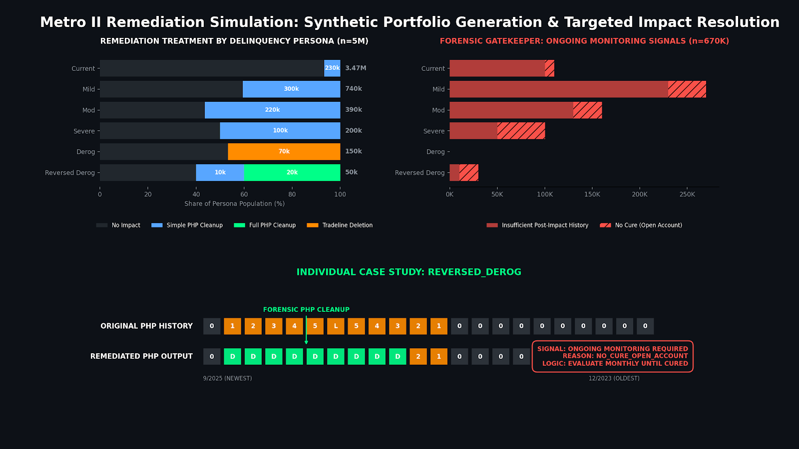

# Metro 2 Remediation Sandbox: Synthetic Portfolio and Impact Engine

## Strategic Intent: Synthetic Credit Reporting Remediation Without PII

How do you simulate high-stakes credit reporting remediation logic without exposing customer data, risking production reporting integrity, or relying on opaque before-and-after outputs?

This project is a modular PostgreSQL remediation sandbox that builds a synthetic longitudinal Metro 2-style portfolio, applies credit-impact window logic, evaluates cure behavior, assigns remediation treatments, and produces audit-ready before-and-after outputs.

The objective is not to reproduce a production furnishing system. The objective is to create a governed, synthetic environment where remediation logic can be tested, explained, validated, and reviewed before any production-like implementation.

This project demonstrates a practical remediation design principle:

> Remediation logic should be tested against a behavioral truth source before it is applied to reported artifacts.

---

## Executive Dashboard

[](./docs/executive_dashboard_preview.png)

[Open dashboard full size](./docs/executive_dashboard_preview.png)

The dashboard translates the remediation engine into an executive view of treatment distribution, monitoring risk, and a case-level before-and-after payment history profile example.

---

## System Overview

The sandbox contains two PostgreSQL modules.

| Module | Purpose | Primary Outputs |
|---|---|---|
| **Module 1: Synthetic Portfolio Generator** | Builds a synthetic Metro 2-style portfolio with account-level blueprints, month-level status history, longitudinal snapshots, and final account-level output. | `metro2_account_blueprint`, `metro2_status_history`, `metro2_sample`, `metro2_final` |
| **Module 2: Remediation Engine** | Builds simulated remediation inputs, evaluates credit impact windows, determines cure behavior, assigns remediation treatments, and produces remediated delta fields. | `metro2_remediation_input`, `metro2_remediation_window_eval`, `metro2_remediation_php_detail`, `metro2_remediation_final` |

High-level flow:

```text
Synthetic Account Blueprint
→ Month-Level Status History
→ Longitudinal PHP Snapshots
→ Final Account-Level Metro 2-Style Output
→ Simulated Remediation Input
→ Credit Impact Window Evaluation
→ Cure and Manual Review Logic
→ Treatment Assignment
→ Month-Level Remediation Detail
→ Final Before / After Delta Output
→ QA Review
```

---

## Module 1: Synthetic Portfolio Generator

Primary source file:

[`src/module_01_metro2_synthetic_portfolio_generator.sql`](./src/module_01_metro2_synthetic_portfolio_generator.sql)

Module 1 builds the synthetic behavioral backbone used by the remediation engine.

### Core Design Principle

Payment History Profile strings are treated as output artifacts, not as the computational backbone.

Instead of repeatedly exploding and reassembling PHP strings, Module 1 materializes a reusable month-level truth table:

```text
metro2_status_history
```

This table stores one row per account per represented month and becomes the source for both longitudinal snapshots and final account-level outputs.

### Default Portfolio Scale

The default sample size is:

```text
5,000,000 synthetic accounts
```

Default profile mix:

```text
CURRENT  = 70%
MILD     = 15%
MOD      =  8%
SEVERE   =  4%
DEROG    =  3%
```

The script validates that percentages are within range and sum to 1.000000 before generating the portfolio.

### Modeled Account Profiles

Module 1 generates synthetic behavioral patterns across:

- current accounts
- mild delinquency accounts
- moderate delinquency accounts
- severe delinquency accounts
- derogatory accounts
- reversed-major-derogatory examples

The reversed-major-derogatory pattern is intentionally included to support remediation testing where post-derog recovery evidence matters.

### Metro 2-Style Fields Modeled

The synthetic output includes:

- account
- latest date of account information
- date closed
- full payment history profile
- account status 17A
- payment rating 17B
- date of first delinquency

### Main Module 1 Outputs

| Output Table | Purpose |
|---|---|
| `metro2_account_blueprint` | Account-level generation metadata and behavioral pattern assignment |
| `metro2_status_history` | Month-level truth table for account performance |
| `metro2_sample` | Longitudinal account / DOAI / PHP snapshot table |
| `metro2_final` | Final account-level Metro 2-style output for downstream remediation logic |

---

## Module 2: Credit Impact Window and Remediation Engine

Primary source file:

[`src/module_02_metro2_remediation_engine.sql`](./src/module_02_metro2_remediation_engine.sql)

Module 2 builds the remediation layer on top of the Module 1 synthetic portfolio.

### Main Objectives

Module 2 performs four major jobs:

1. Simulates a bank-side financial remediation input table.
2. Determines the credit reporting impact timeframe.
3. Assigns a remediation treatment.
4. Produces remediated delta fields and audit flags.

### Key Concepts

#### Financial Impact Window

The financial impact window is the simulated business input:

```text
impact_start_date
impact_end_date
```

#### Credit Impact Window

The credit impact window is the reporting impact period evaluated by the remediation engine:

```text
credit_impact_start_date
credit_impact_end_date
credit_cure_date
```

The credit impact end date may extend beyond the financial impact end date because the project allows time for the customer to stabilize from a credit reporting standpoint.

#### Cure Logic

The default cure rule requires:

```text
3 consecutive post-impact months of literal status = '0'
```

Important boundaries:

- cure is evaluated after `impact_end_date`
- only literal `0` counts as cure
- `B` and `D` do not count as cure
- the default 3-month rule is a conservative project assumption, not presented as a formal Metro 2 requirement

### Manual Review Logic

Manual review is intended to identify accounts where credit reporting impact may still be ongoing.

The framework distinguishes between:

- closed accounts with no cure
- open accounts with insufficient post-impact history
- open accounts with no cure
- accounts with no delinquency or derogatory content in the credit impact window

This prevents the engine from sending clean, no-impact cases to unnecessary manual review.

### Remediation Treatments

Module 2 assigns one of four treatments:

| Treatment | Meaning |
|---|---|
| `TRADELINE_DELETION` | Most conservative treatment when unresolved derogatory impact remains |
| `FULL_DEROGATORY_PHP_CLEANUP` | Suppresses delinquency and derogatory bytes inside the credit impact window |
| `SIMPLE_DELINQUENCY_PHP_CLEANUP` | Suppresses delinquency bytes inside the credit impact window |
| `NO_IMPACT_CLEAN_PHP_HISTORY` | No credit reporting impact identified |

### Version 2 Deletion Override Logic

Version 2 corrects a false-positive deletion risk for reversed-major-derogatory scenarios.

Tradeline deletion now requires:

```text
derogatory event in the credit impact window
AND
no later payment-performance recovery evidence after the most recent derog month
```

This matters because an account can recover from a major derogatory state but still fail the configured cure threshold. That case should route through normal evaluation / cleanup logic, not automatic deletion.

### Remediated Delta Fields

Module 2 produces delta-based remediated fields:

- `remediated_full_php`
- `remediated_account_status_17A`
- `remediated_payment_rating_17B`
- `remediated_date_of_first_delinquency`

Delta-based design means remediated fields are populated only when a change is actually made. If a field does not change, the remediated field remains `NULL`.

### Main Module 2 Outputs

| Output Table | Purpose |
|---|---|
| `metro2_remediation_input` | Simulated remediation input: account, impact start, impact end |
| `metro2_remediation_window_eval` | Credit impact window, cure, manual review, recovery, and treatment logic |
| `metro2_remediation_php_detail` | Month-level original vs remediated status detail |
| `metro2_remediation_final` | Final account-level remediation output with before / after delta fields |

---

## Executive Interpretation

### The Cure Philosophy

This project defines behavioral cure as a sustained post-impact sequence of current performance, not a single status change.

That creates a defensible recovery point and helps distinguish between:

- customers who stabilized after the issue ended
- open accounts with insufficient post-impact history
- open accounts with no cure
- accounts needing ongoing monitoring

### Defending the Recovery

The Version 2 deletion override protects accounts with post-derogatory recovery evidence from unnecessary tradeline deletion.

This supports a more nuanced approach than blunt wipe logic:

```text
protect favorable recovery evidence
avoid false-positive deletions
preserve customer-centric reporting outcomes
```

### Before / After Evidence

The final remediation output provides a clear view of original context, credit impact dates, treatment assignment, remediated fields, and audit flags.

The goal is to make the remediation decision explainable to technical reviewers, business owners, risk stakeholders, and governance teams.

### Ongoing Monitoring Signals

The dashboard highlights no-cure and insufficient-history populations that may require monitoring rather than immediate remediation closure.

This supports a practical remediation distinction:

```text
resolved impact
vs.
open monitoring signal
vs.
manual review need
```

---

## Technical Architecture

### PostgreSQL-First Design

The project is built in PostgreSQL and intended for local execution in DBeaver.

The scripts are not optimized for lightweight browser sandboxes. They are designed as working SQL modules and teaching artifacts.

### Dedicated Schemas

The modules use separate schemas:

```text
module1
module2
```

This keeps generation outputs and remediation outputs organized and easier to inspect.

### Deterministic Synthetic Logic

Both modules use deterministic hash-based variation so reruns with the same parameters produce stable synthetic behavior.

This supports repeatable demonstrations, validation, and walkthroughs.

### Month-Level Truth Source

The core design choice is to compute a month-level status history once and reuse it downstream.

This makes the project:

- easier to validate
- easier to audit
- easier to explain
- more efficient than repeatedly exploding PHP strings

### Parameterized Controls

Module 1 centralizes portfolio mix and sample size parameters.

Module 2 centralizes the cure threshold:

```text
cure_consecutive_months_required
```

This allows reviewers to test what-if scenarios, such as changing the number of post-impact current months required for cure.

### QA and Review Queries

The scripts include review queries that inspect:

- parameter settings
- profile mix
- closed-status mix
- month-level status history
- synthetic snapshots
- final outputs
- remediation treatment counts
- manual review reasons
- month-level remediation detail
- tradeline deletion examples
- full derogatory cleanup examples
- simple delinquency cleanup examples
- no-impact examples
- remediated field changes
- post-derog recovery edge cases

---

## Repository Contents

```text
metro2-remediation-sandbox/
│
├── README.md
│
├── docs/
│   └── executive_dashboard_preview.png
│
└── src/
    ├── module_01_metro2_synthetic_portfolio_generator.sql
    └── module_02_metro2_remediation_engine.sql
```

### Core Artifacts

| Artifact | Purpose |
|---|---|
| [`docs/executive_dashboard_preview.png`](./docs/executive_dashboard_preview.png) | Executive dashboard preview |
| [`src/module_01_metro2_synthetic_portfolio_generator.sql`](./src/module_01_metro2_synthetic_portfolio_generator.sql) | Synthetic longitudinal tradeline and Metro 2-style portfolio generator |
| [`src/module_02_metro2_remediation_engine.sql`](./src/module_02_metro2_remediation_engine.sql) | Credit impact window and remediation treatment engine |

---

## How to Run

### 1. Execute Module 1

Run:

```text
src/module_01_metro2_synthetic_portfolio_generator.sql
```

This builds:

```text
module1.metro2_account_blueprint
module1.metro2_status_history
module1.metro2_sample
module1.metro2_final
```

### 2. Execute Module 2

Run:

```text
src/module_02_metro2_remediation_engine.sql
```

This builds:

```text
module2.metro2_remediation_input
module2.metro2_remediation_window_eval
module2.metro2_remediation_php_detail
module2.metro2_remediation_final
```

### 3. Review QA Queries

Both scripts include QA / review sections at the bottom.

For Module 2, the most important final output is:

```text
module2.metro2_remediation_final
```

Use it to inspect:

- original PHP
- credit impact start / end dates
- cure date
- remediation treatment
- remediated PHP
- remediated 17A
- remediated 17B
- remediated DOFD
- manual review flag
- remediation fields modified

---

## Supported Boundaries

This is a synthetic remediation-learning module, not a production furnishing engine.

Important boundaries:

- The project models Metro 2-style concepts but does not reproduce every production furnishing edge case.
- The default 3-month cure rule is a project assumption, not a formal Metro 2 requirement.
- Remediated fields are delta-based and remain `NULL` when no change is written.
- Tradeline deletion is represented using a synthetic remediation code `DA`.
- D behaves like 0 only for remediated derived field logic.
- The synthetic remediation input table is deterministically generated for demonstration purposes.
- The engine evaluates methodology and governance logic; it does not make production credit reporting decisions.

---

## Data Privacy and Interpretation Boundaries

All data and visual outputs in this repository are generated from synthetic or anonymized datasets to protect proprietary information.

This framework demonstrates methodology for high-stakes enterprise and regulatory environments, but it does not expose real customer data, proprietary furnishing rules, confidential remediation controls, or regulated production pipelines.

Important interpretation boundaries:

- Outputs are synthetic portfolio artifacts.
- The engine is not a production Metro 2 furnishing system.
- The remediation treatments are simulation outputs.
- QA queries are review aids, not formal regulatory certifications.
- Any production remediation logic would require legal, compliance, furnishing, model risk, and operational governance review.

---

## Portfolio Philosophy

**No Cold Handoffs** — engineering zero-defect, audit-ready results so stakeholders internalize the underlying “why.”

This project is designed to ensure that remediation logic does not stop at technical execution. The goal is to make the treatment logic, recovery assumptions, monitoring signals, and before-and-after outputs clear enough for technical, risk, legal, finance, and operations stakeholders to understand the remediation rationale.
